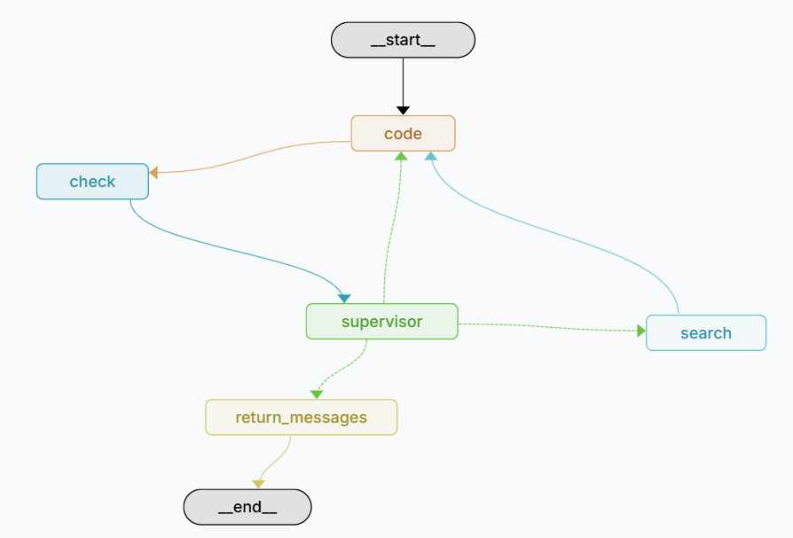

# 🤖 Agente de Codificação Inteligente com LangGraph

|||
|-----------|-----------|
| **Testing**  | [](https://github.com/Jeferson100/Code-Agent/actions/workflows/teste.yml)|
| **Package**  |         |
| **App Streamlit** | <p align=""><a href="https://jeferson100-code-agent-appapp-code-streamlit-m6r4fj.streamlit.app/" target="_blank"></a></p> ||
| | |


Um agente de IA para assistência em programação, construído com **LangGraph** para orquestração de fluxos de trabalho complexos e múltiplas interfaces de usuário (Streamlit, Chainlit, FastAPI).

## 📋 Visão Geral

Este projeto implementa um **agente de codificação stateful** que combina múltiplos modelos de linguagem (LLMs) com ferramentas externas para criar um assistente de programação inteligente e autônomo. O agente é capaz de:

 <p align="center">

</p>

- 🧠 **Gerar código** a partir de especificações em linguagem natural
- 🔍 **Analisar e depurar** código existente com feedback iterativo
- 🔧 **Refatorar código** para melhorar qualidade e performance
- 🌐 **Buscar informações** na web para contexto adicional
- ⚡ **Executar e validar** código Python em tempo real
- 🔄 **Auto-correção** através de ciclos de feedback supervisionados

## ✨ Características Principais

### 🏗️ Arquitetura Baseada em LangGraph
- **Fluxo de trabalho não-linear**: O agente pode tomar decisões e iterar baseado em resultados
- **Estados persistentes**: Mantém contexto entre interações
- **Roteamento inteligente**: Escolhe automaticamente entre diferentes LLMs (Groq, HuggingFace)
- **Fallback automático**: Se um modelo falha, tenta outros automaticamente

### 🎯 Nós Especializados
- **`node_code`**: Gera código usando LLMs especializados
- **`node_supervisor`**: Avalia e fornece feedback sobre código gerado
- **`node_search`**: Busca informações na web quando necessário
- **`python_repl`**: Executa e valida código Python
- **`should_continue`**: Decide o próximo passo baseado no contexto

### 🛠️ Ferramentas Integradas
- **Tavily Search**: Busca inteligente na web
- **Python REPL**: Execução segura de código
- **Múltiplos LLMs**: Groq, HuggingFace, NVIDIA AI Endpoints
- **Estruturação de dados**: Saídas estruturadas com Pydantic

### 🎨 Múltiplas Interfaces
- **Streamlit**: Interface web interativa e responsiva
- **Chainlit**: Chat interface moderna e conversacional
- **FastAPI**: API REST para integração com outros sistemas
- **Docker**: Execução em containers Docker atraves do Docker-Compose

## 📁 Estrutura do Projeto

```
Code-Agent/
├── 📁 src/code_agent/           # Código principal do agente
│   ├── 📁 build_graph/          # Construção do grafo LangGraph
│   ├── 📁 nodes/                # Nós especializados do workflow
│   ├── 📁 get_routem_llm/       # Roteamento inteligente de LLMs
│   ├── 📁 states_outputs/       # Definições de estados e saídas
│   ├── 📁 prompts/              # Templates de prompts
│   └── 📁 tools/                # Ferramentas externas
├── 📁 app/                      # Interfaces de usuário
│   ├── app_streamlit.py         # Interface Streamlit
│   ├── app_chainlit.py          # Interface Chainlit
│   ├── app_fastapi.py           # API REST
│   └── graph_cli.py             # Interface CLI
├── 📁 tests/                    # Testes automatizados
├── 📁 notebooks/                # Jupyter notebooks de exemplo
└── 📄 requirements.txt          # Dependências
```

## 🚀 Instalação e Configuração

### Pré-requisitos
- Python 3.12+
- Chaves de API (Groq, Tavily, HuggingFace, NVIDIA AI Endpoints e Pydantic_Ai)

### 1. Clone o Repositório
```bash
git clone https://github.com/seu-usuario/Code-Agent.git

cd Code-Agent
```

### 2. Instale as Dependências
```bash
# Usando uv (recomendado)
uv sync

# Ou usando pip
pip install -r pyproject.toml
```

### 3. Configure as Variáveis de Ambiente
Crie um arquivo `.env` na raiz do projeto:

```env
# LLM APIs
GROQ_API_KEY="sua_chave_groq_aqui"
TAVILY_API_KEY="sua_chave_tavily_aqui"
HUGGINGFACE_API_TOKEN="seu_token_huggingface_aqui"
NVIDIA_API_KEY="sua_chave_nvidia_aqui"
PYDANTIC_API_KEY="sua_chave_pydantic_aqui"
```

## 🎮 Como Usar

### 🐳 Executando com Docker

O Agente-Codificação pode ser executado em um container Docker, permitindo uma execução simples e consistente.

```bash 
docker build -t agente-codificacao-app .
docker run -p 3000:3000 agente-codificacao-app

docker-compose build
docker-compose up
```

### 🚀 Executando com Streamlit

O Agente-Codificação pode ser utilizado com o Streamlit, atraves do seguinte link:

<p align=""><a href="https://jeferson100-code-agent-appapp-code-streamlit-m6r4fj.streamlit.app/" target="_blank"></a></p> 

Tambem pode ser executado localmente, utilizando o seguinte comando:


```bash
pip install -r pyproject.toml
streamlit run app/app_code_streamlit.py
```
Acesse `http://localhost:8501` no seu navegador.

### Interface Chainlit (Chat)

```bash
pip install -r pyproject.toml
chainlit run app/app_chainlit.py
```
Acesse `http://localhost:8000` no seu navegador.


## 📊 Tecnologias Utilizadas

- **LangGraph**: Orquestração de workflows
- **LangChain**: Framework de LLMs
- **Streamlit**: Interface web
- **Chainlit**: Chat interface
- **FastAPI**: API REST
- **Pydantic**: Validação de dados
- **Tavily**: Busca na web
- **Groq**: Modelos de linguagem
- **HuggingFace**: Modelos alternativos

## 📄 Licença

Este projeto está licenciado sob a [Licença MIT](LICENSE).

